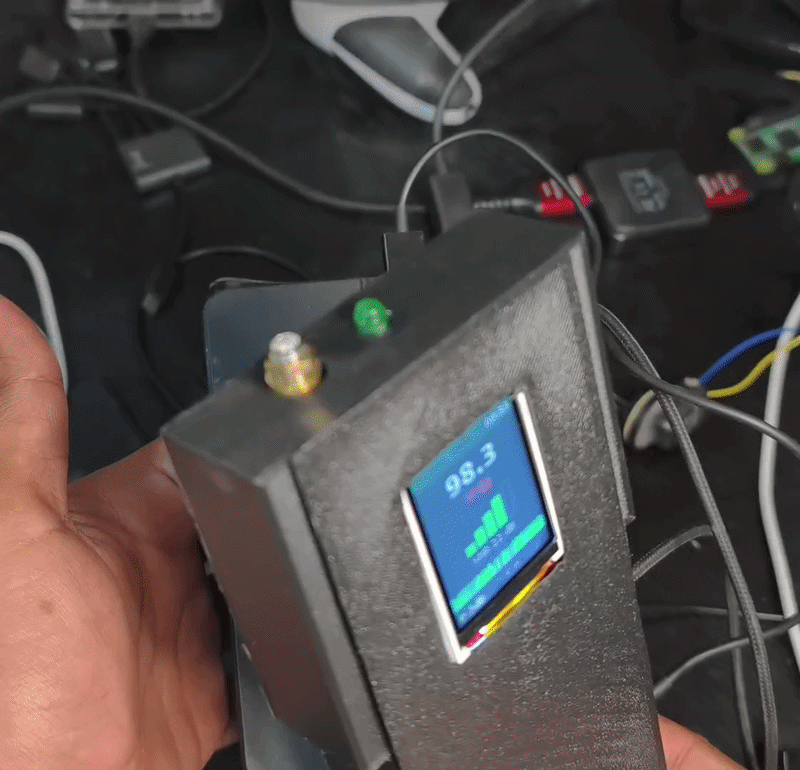
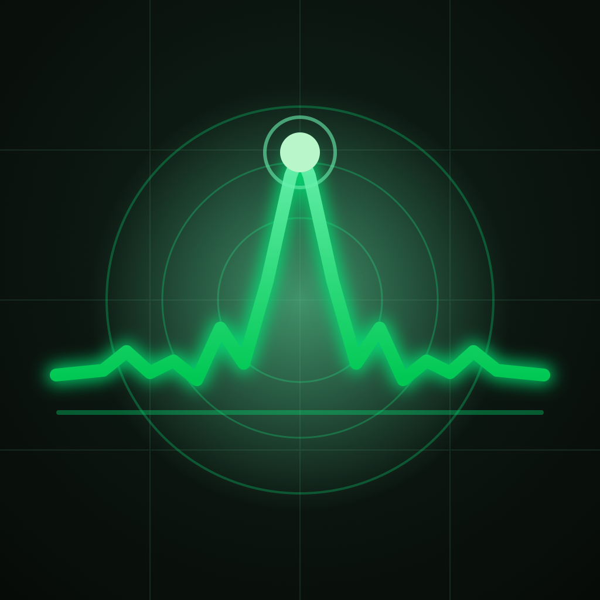
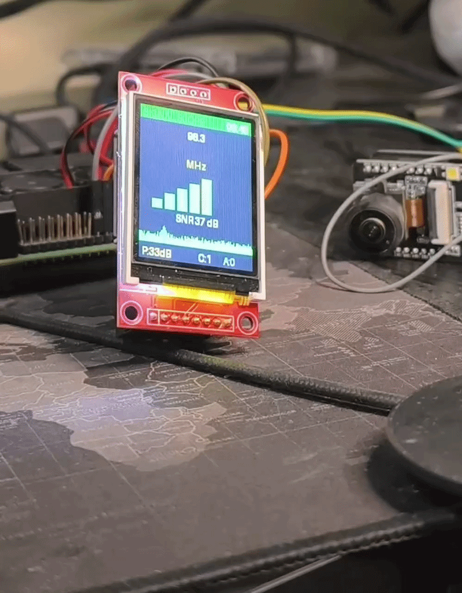
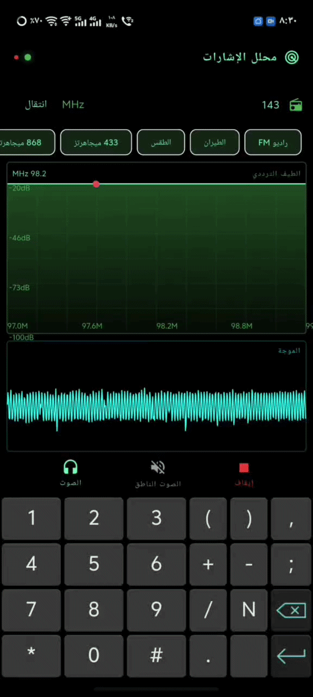
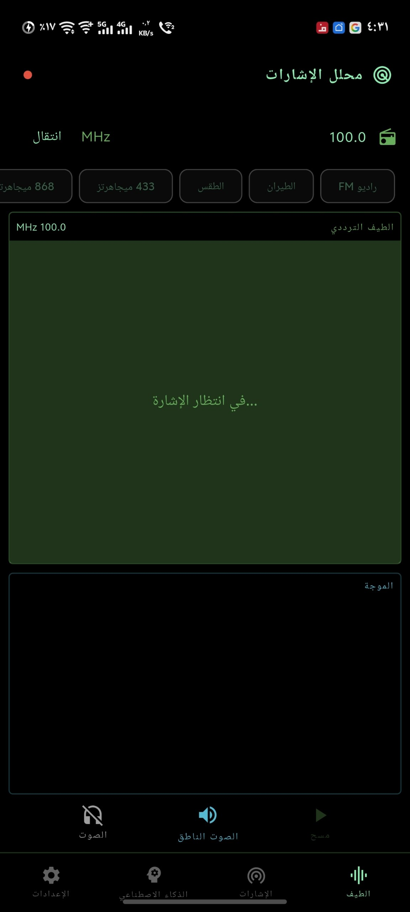
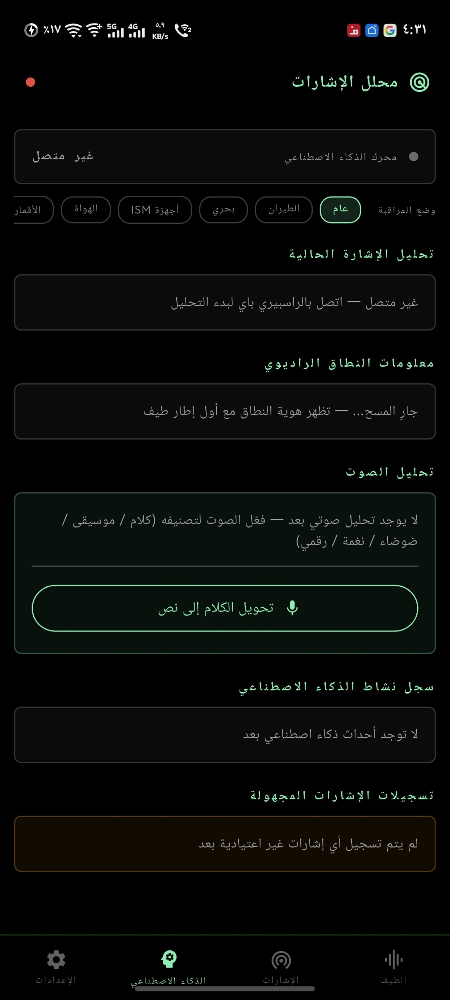
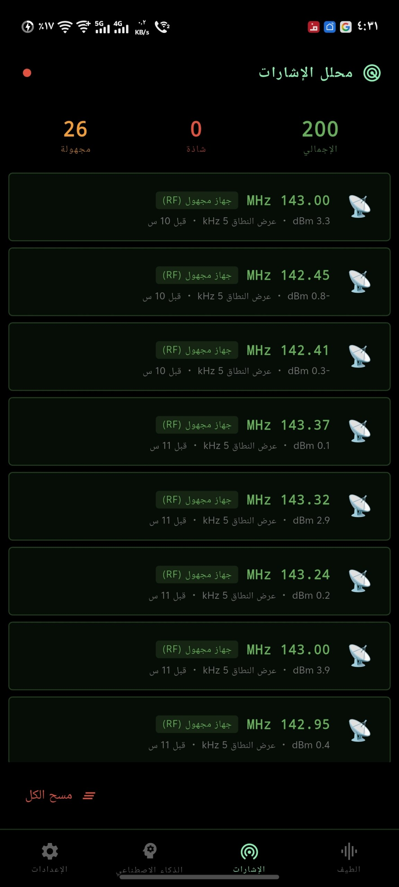
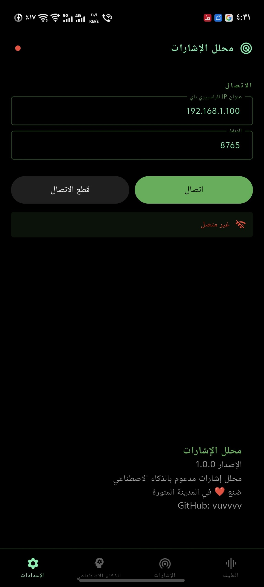
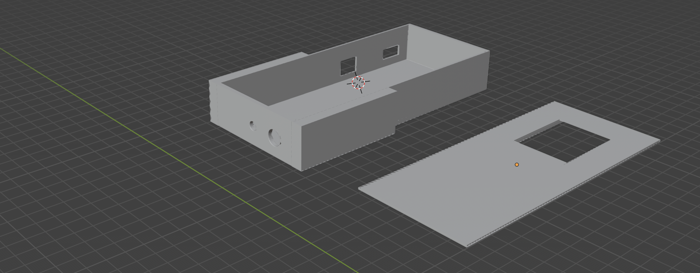
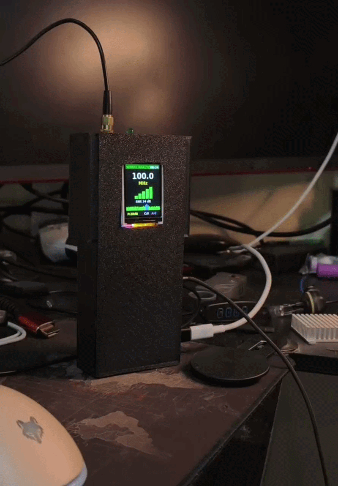

# Signal Analyzer محلل الاشارات
## RTL-SDR Radio Signal Analyzer with AI Detection

<p align="center">
  
</p>

<p align="center">
  
   &nbsp;&nbsp;
  
   &nbsp;&nbsp;
  
</p>
<br><br>

Signal Analyzer is a real-time RF spectrum analyzer built with Flutter, Raspberry Pi, and an RTL SDR receiver. It transforms inexpensive RTL SDR hardware into a portable signal analyzer capable of scanning the RF spectrum, detecting and classifying signals with an AI powered anomaly engine, demodulating supported transmissions, and streaming live spectrum data and detections to a mobile application via WebSocket.

Designed for completely local operation, Signal Analyzer requires no cloud infrastructure, no API keys, and no internet connection. Every component from SDR acquisition and DSP processing to AI inference and visualization runs entirely on the Raspberry Pi and communicates with the Flutter app over your local Wi-Fi network, delivering fast, private, and reliable real-time analysis.

<table align="center">
<tr>
<td align="center">
<b></b><br>

</td>

</tr>
</table>

<br><br>

## Features

- 📊 **Live spectrum & waterfall** — real-time FFT streamed to the Flutter app (MessagePack over WebSocket)
- 🤖 **AI signal detection** — IsolationForest anomaly scoring + band-aware technology matching (Wi-Fi, BLE, LoRa, FM, airband, pagers…)
- 🔊 **On-Pi audio** — WFM / NFM / AM / USB / LSB via a patched `rtl_fm`, CW via `csdr`; audio plays on the Pi's own output
- 🎙️ **Audio classification & Speech-To-Text** — optional TFLite audio classifier and Vosk STT (CPU-only, degrade gracefully if models are missing)
- 🗂️ **RF band database** — table-driven catalogue of allocations, no station names, overlaps handled
- 🖥️ **ST7735 dashboard** — 1.8" LCD on the Pi shows status and alerts, plus a GPIO status LED
- 📼 **IQ capture** — record and compare captures, served over a built-in HTTP endpoint

<br><br>

## How It Works

1. `SdrReader` owns the single RTL-SDR handle and streams raw IQ
2. IQ fans out through drop-oldest queues to the **audio**, **spectrum**, and **AI** workers — no stage can ever block another
3. CPU-heavy AI work (anomaly retraining, audio classification, STT) runs in **separate OS processes** so it never steals time from the real-time path
4. The asyncio event loop pushes results to the Flutter app: AI detections are never dropped, spectrum frames are throttled to only the newest
5. Audio is demodulated and played **on the Pi itself** — no PCM ever crosses the WebSocket, the app only sends control commands

```
SdrReader (RTL-SDR)
   ├── AudioWorker ──► rtl_fm_pipe / csdr ──► Pi speaker
   │        └── AudioClassifierWorker / SttWorker (processes)
   └── SpectrumWorker ──► AiWorker (process, IsolationForest)
                └──► WebSocket ──► Flutter app 📱
```

<br><br>

## Hardware Required

| Component             | Model / Spec                                   |
| --------------------- | ---------------------------------------------- |
| Single-board computer | **Raspberry Pi** (any model with GPIO)         |
| SDR receiver          | **RTL-SDR dongle** (RTL2832U based)            |
| Display               | **ST7735 — 1.8 inch — 128×160 pixels**         |
| Status LED            | Any LED on **GPIO 18** (Pin 12)                |
| Audio output          | Pi's 3.5mm jack / USB audio (played via `sox`) |
| Phone                 | Any device running the Flutter app             |
| Network               | Shared Wi-Fi router **or** phone hotspot       |

<br>

## Wiring — ST7735 → Raspberry Pi

| ST7735 Pin | Function     | Pi GPIO (BCM) | Notes                   |
| ---------- | ------------ | ------------- | ----------------------- |
| VCC        | Power        | 3.3V          | ⚠️ 3.3V only — never 5V |
| GND        | Ground       | GND           | Common ground           |
| SCL / SCLK | SPI Clock    | GPIO 11       | Hardware SPI            |
| SDA / MOSI | SPI Data     | GPIO 10       | Hardware SPI            |
| CS         | Chip Select  | GPIO 8        | CE0                     |
| DC / RS    | Data/Command | GPIO 24       |                         |
| RES / RST  | Reset        | GPIO 25       |                         |
| LED        | Status LED   | GPIO 18       | Pin 12, with resistor   |

💡 The screen runs in **portrait mode (128×160)** and the install script enables hardware SPI for you.

<br><br>

## Raspberry Pi Setup

### 1. Install everything

```bash
cd backend
chmod +x install.sh
./install.sh
```

The script installs system packages, blacklists the DVB kernel driver, enables SPI, builds `csdr` and `rtl_fm_pipe` from source, and sets up the Python venv.

### 2. (Optional) AI extras

Drop the models in `backend/models/` to unlock the extra features — everything works without them:

```
backend/models/audio_classifier.tflite   # audio classification
backend/models/vosk-model-small/         # Speech-To-Text button
```

### 3. Run the server

```bash
source venv/bin/activate
python signal_server.py
```

The WebSocket server listens on port **8765**.

### Prebuilt Modules

Three modules of the analyzer ship as **precompiled native extensions** (`.so`) instead of Python source: `signal_analyzer`, `channel_id`, and `fingerprint_store`. Everything else in the backend is open source — you can read it, modify it, and extend it freely.

Nothing extra to do: the `.so` files are already in `backend/` and Python imports them automatically. `install.sh` verifies they load on your Pi. They are built for **Raspberry Pi OS (64-bit)** with its stock Python — if the check fails on your setup (different architecture or Python version), open an issue with your `uname -m` and `python3 -V` output.

<br><br>

## Flutter App Setup


<table align="center">
<tr>
<td align="center">
<b>الرئيسيه</b><br>

</td>

<td align="center">
<b>Ai </b><br>

</td>

<td align="center">
<b>الاشارة</b><br>

</td>

<td align="center">
<b>الاعدادات</b><br>

</td>
</tr>
</table>

<br><br>

### 1. Build & install

```bash
flutter pub get
flutter run
```

### 2. Connect

Open the **Settings** tab and enter your Pi's IP with port `8765`, then start scanning. The **Spectrum**, **Signals**, and **AI** tabs update in real time — with local notifications and TTS alerts for high-priority detections.

<br><br>

## App Screens

| Tab          | What it shows                                              |
| ------------ | ---------------------------------------------------------- |
| 📊 Spectrum  | Live FFT / waterfall, frequency tuning, demodulator + audio controls |
| 📡 Signals   | Detected signals with band, technology, and SNR            |
| 🤖 AI        | Anomaly scores, audio classification, Speech-To-Text, captures |
| ⚙️ Settings  | Pi connection, alerts, preferences                          |

<br><br>

## Pi Server Protocol

| Message              | Direction     | Description                              |
| -------------------- | ------------- | ---------------------------------------- |
| `set_freq`           | app → Pi      | Tune to a frequency                      |
| `set_demodulator`    | app → Pi      | WFM / NFM / AM / USB / LSB / CW          |
| `start_audio` / `stop_audio` | app → Pi | Toggle on-Pi audio playback          |
| `set_volume` / `mute` / `unmute` | app → Pi | Audio control                     |
| `start_stt` / `stop_stt` | app → Pi  | Toggle Speech-To-Text                    |
| spectrum / waveform  | Pi → app      | Throttled, newest-frame-only             |
| AI detections        | Pi → app      | Priority — never dropped                 |
<br><br>

## 3D Print Files

A printable enclosure for the Pi + ST7735 build, found in the [`3D/`](3D/) folder:

- [`signalbox.stl`](3D/signalbox.stl) — main box
- [`signalcaver.stl`](3D/signalcaver.stl) — cover

<p align="center">
  
</p>


<br><br>

## Project Structure

```
SignalـAnalyzer/
├── 3D/                           # 3D-printable enclosure
│   ├── signalbox.stl             # main box
│   └── signalcaver.stl           # cover
├── lib/                          # Flutter app
│   ├── main.dart
│   ├── screens/
│   │   ├── home_screen.dart
│   │   ├── spectrum_screen.dart
│   │   ├── signals_screen.dart
│   │   ├── ai_screen.dart
│   │   └── settings_screen.dart
│   ├── services/
│   │   └── sdr_service.dart      # WebSocket + msgpack client
│   ├── models/
│   ├── utils/
│   └── widgets/
│       └── spectrum_painter.dart
├── backend/                      # Raspberry Pi server
│   ├── signal_server.py          # WebSocket server + pipeline
│   ├── sdr_reader.py             # RTL-SDR IQ reader
│   ├── spectrum_worker.py        # FFT
│   ├── ai_worker.py              # IsolationForest (own process)
│   ├── signal_analyzer.so        # signal classification engine (prebuilt, closed-source)
│   ├── channel_id.so             # channel/band identity (prebuilt, closed-source)
│   ├── fingerprint_store.so      # signal fingerprint memory (prebuilt, closed-source)
│   ├── band_db.py                # RF allocation database
│   ├── audio_worker.py           # demod pipeline
│   ├── rtl_fm_chain.py           # WFM/NFM/AM/USB/LSB via rtl_fm_pipe
│   ├── csdr_chain.py             # CW via csdr
│   ├── audio_classifier_worker.py
│   ├── stt_worker.py             # Vosk Speech-To-Text
│   ├── capture_manager.py        # IQ captures
│   ├── screen_controller.py      # ST7735 dashboard
│   ├── led_controller.py         # status LED
│   ├── vendor/rtl_fm_pipe.c      # patched rtl_fm (stdin IQ)
│   └── install.sh
└── assets/
```

<br><br>


<p align="center">
  
</p>

[@vuvvvv](https://github.com/vuvvvv)
